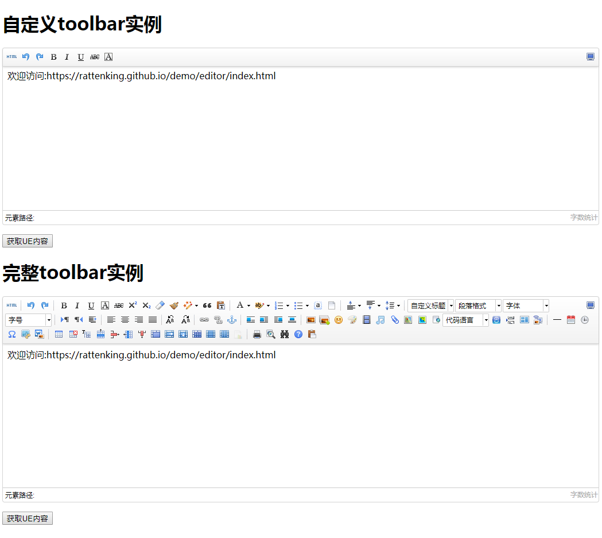

# UEditor富文本编辑器的简单入门
### 首先既然我们要用UEditor插件，我们就需要引入对应的文件，在UEditor官网[下载](http://ueditor.baidu.com/website/download.html)，然后将static文件夹拷贝到我们项目的根目录下，接下来就是引用：
----
* 引入配置文件
  >   \<script src="static/UE/ueditor.config.js"\>\</script\>
* 引入all.js
  >   \<script src="static/UE/ueditor.all.min.js"\>\</script\>
* 引入parse.js
  >   \<script src="static/UE/ueditor.parse.min.js"\>\</script\>
### UEditor的盒子
  >   \<script id="editor" type="text/plain"\>\</script\>
### 实例UEditor
```
//实例化编辑器,自定义toolbar实例
var ue = UE.getEditor( 'editor', {
    //设置工具栏按钮：全屏，源代码，撤销，重做，加粗，斜体，下划线，删除线，字符边框
    toolbars:[['FullScreen', 'Source', 'Undo', 'Redo','Bold','italic','underline','test','strikethrough','fontborder']],
    //初始化编辑器的内容！
    initialContent: '欢迎访问:https://rattenking.github.io/demo/editor/index.html',
    //初始化时，是否让编辑器获得焦点true或false
    focus:false,
    //focus时自动清空初始化时的内容
    autoClearinitialContent:true,
    //编辑器层级的基数,可以用来改变字体等
    initialStyle:'p{line-height:1em}',
    //提交到后台的数据是否包含整个html字符串
    allHtmlEnabled:false,
    //默认的编辑区域宽度
    initialFrameWidth: null,
    //默认的编辑区域高度
    initialFrameHeight:250

});
```
### 完整代码
```
<!DOCTYPE html>
<html lang="en">
<head>
    <meta charset="UTF-8">
    <meta name="viewport" content="width=device-width, initial-scale=1.0">
    <meta http-equiv="X-UA-Compatible" content="ie=edge">
    <title>UEditor富文本编辑器</title>
    <script src="static/UE/ueditor.config.js"></script>
    <script src="static/UE/ueditor.all.min.js"></script>
    <script src="static/UE/ueditor.parse.min.js"></script>
</head>
<body>
    <h1>自定义toolbar实例</h1>
    <div><script id="editor" type="text/plain"></script></div>
    <p><button onclick="getContent(0)">获取UE内容</button></p>
    <h1>完整toolbar实例</h1>
    <div><script id="editor1" type="text/plain"></script></div>
    <p><button onclick="getContent(1)">获取UE内容</button></p>
    <script type="text/javascript">
        
        //实例化编辑器,自定义toolbar实例
        var ue = UE.getEditor( 'editor', {
                //设置工具栏按钮：全屏，源代码，撤销，重做，加粗，斜体，下划线，删除线，字符边框
                toolbars:[['FullScreen', 'Source', 'Undo', 'Redo','Bold','italic','underline','test','strikethrough','fontborder']],
                //初始化编辑器的内容！
                initialContent: '欢迎访问:https://rattenking.github.io/demo/editor/index.html',
                //初始化时，是否让编辑器获得焦点true或false
                focus:false,
                //focus时自动清空初始化时的内容
                autoClearinitialContent:true,
                //编辑器层级的基数,可以用来改变字体等
                initialStyle:'p{line-height:1em}',
                //提交到后台的数据是否包含整个html字符串
                allHtmlEnabled:false,
                //默认的编辑区域宽度
                initialFrameWidth: null,
                //默认的编辑区域高度
                initialFrameHeight:250
        
            });
        //完整toolbar实例
        //实例化一个不带ui的编辑器,注意此处的实例化对象是baidu.editor下的Editor，而非baidu.editor.ui下的Editor
        var myeditor = UE.getEditor('editor1',{
            initialContent: '欢迎访问:https://rattenking.github.io/demo/editor/index.html',//初始化编辑器的内容
            initialFrameWidth: null,
            initialFrameHeight: 250
        });
        //获取UE内容
        function getContent(num){
            var obj = null;
            if(num === 0){
                obj = ue;
            }else if(num === 1){
                obj = myeditor;
            }
            var str = obj.getContent();
            alert(str);
        }
        </script>    
</body>
</html>
```

* [demo下载](http://download.csdn.net/download/m0_38082783/10025836)
* [demo效果](https://rattenking.github.io/demo/editor/index.html)
